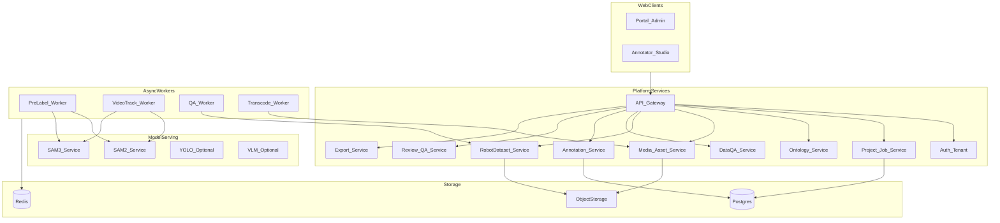

# 02 — 系统架构

## 1. 设计原则

1. **Web 优先**：标注与管理同一套浏览器体验；模型在 GPU 侧车。  
2. **机器人数据一级公民**：Dataset / Episode 服务与通用 Media 分离，避免硬套「图片文件夹」。  
3. **同步交互 + 异步重活**：点击 SAM 走低延迟 RPC；批量预标 / QA / 转码走队列。  
4. **预测与标注分层**：Prediction 可一键晋升为 Annotation，保留模型溯源。  
5. **租户隔离**：数据与密钥按 tenant_id 隔离；Community 可单租户部署。  

## 2. 逻辑架构



## 3. 服务边界

| 服务 | 职责 | 不负责 |
| --- | --- | --- |
| Auth / Tenant | 登录、JWT、角色、租户 CRUD | 业务标注逻辑 |
| Project / Job | 项目、任务拆分、分派、状态机 | 像素级几何存储细节可委托 Annotation |
| Ontology | 标签树、属性、颜色、热键、版本 | 模型权重管理 |
| Media | 上传、转码、缩略图、签名 URL | 解析 LeRobot meta |
| RobotDataset | 导入索引 LeRobot v3、episode 列表、相机映射、task | 通用随便片库 |
| DataQA | 触发/存储质检报告、阈值项 | 重训练模型 |
| Annotation | 几何与实例、版本、与 Prediction 合并 | GPU 推理 |
| Review | 通过/驳回、Issue、抽检指标 | 自动修标注 |
| Export | 打包 COCO/YOLO/LeRobot 扩展 | 直接改原数据集（默认旁路写出） |
| Model Serving | SAM2/3（及可选 YOLO/VLM）推理 API | 用户权限 |

## 4. 技术选型（写死）

| 层 | 选型 | 说明 |
| --- | --- | --- |
| Web 前端 | React + TypeScript | Portal + Studio 同仓或分包 |
| 画布 | 自研轻量 Canvas / WebGL 层 | 交互对标 X-AnyLabeling，不嵌 PyQt |
| API | Python FastAPI | 与模型/LeRobot 生态同语言 |
| DB | PostgreSQL | 租户、项目、作业、标注元数据 |
| 队列 | Redis + Celery 或 RQ | QA、预标、转码、导出 |
| 对象存储 | MinIO / S3 兼容 | 原片 + 预览轨 + 导出物 |
| 模型运行时 | PyTorch GPU 服务 | 参考 `github/sam2`、`github/sam3` |
| 边缘加速（可选） | ONNX Runtime | 参考 X-AnyLabeling 导出路径，非 MVP 必须 |
| 部署 | Docker Compose → K8s | GPU 节点独立 `model-serving` |
| 鉴权 | JWT；Enterprise 预留 OIDC | |

## 5. 部署拓扑

### 5.1 开发 / Community（单机）

```text
[Browser]
    │
[compose: api + worker + postgres + redis + minio]
    │
[compose-gpu: sam2 + sam3]   ← 可与 CPU 同机或第二台 GPU 机
```

### 5.2 Team / 私有化

```text
[LB] → [api x N]
         ├─ [worker CPU: QA / export / transcode]
         ├─ [worker GPU: prelabel / track]
         ├─ [postgres 主从]
         ├─ [redis]
         └─ [S3 / MinIO]
[model-serving] SAM2 | SAM3 | (YOLO) | (VLM)  独立 GPU 池，按队列限流
```

### 5.3 网络与安全

- 浏览器只访问 API / 签名媒体 URL；模型端口不对公网暴露。  
- 租户级 bucket 前缀：`s3://{bucket}/{tenant_id}/...`。  
- 审计：导入、导出、审核动作写 audit log。  

## 6. 与参考项目的集成关系

| 参考 | 用法 |
| --- | --- |
| `github/X-AnyLabeling` | UX / 快捷键 / 预标心智说明书级参考；可选复用 ONNX 导出工具链 |
| `github/cvat` | Job 状态机、Review 流程参考；不引入整套 Django/Nuclio |
| `github/label-studio` | Ontology schema 与 Prediction JSON 形态参考 |
| `github/sam2`、`github/sam3` | 服务内直接依赖或 sidecar 包装官方 predictor |
| `lerobot/script` | QA Worker 调用或移植对齐/质量分析模块 |

## 7. 关键路径示意

```text
Client ──REST/WS──► API ──DB──► Postgres
                      │
                      ├──► Redis queue ──► Workers ──► Model HTTP
                      └──► S3 预签名读写媒体
```

交互式分割：Studio → `POST /models/sam2/predict`（经 API 鉴权代理或短时 token）→ 返回 mask RLE / polygon。  
批量预标：Manager → `POST /projects/{id}/prelabel` → Worker → 写 Prediction 表。  

## 8. 可观测性

- API：请求延迟、错误率、按租户 QPS  
- Worker：队列深度、任务失败重试、GPU 利用率  
- QA / 预标：采纳率、人均 episode 耗时（产品指标回传）  

日志结构化 JSON；Team 以上可接 OpenTelemetry。  
