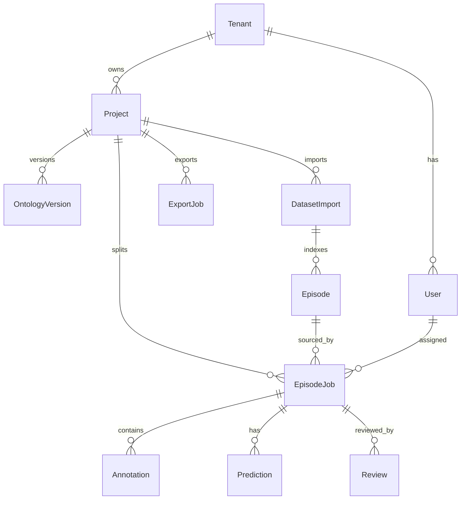

# 03 — 领域模型与 API 资源草图

## 1. 聚合根一览



## 2. 实体说明

### 2.1 Tenant / User / Role

| 字段要点 | 说明 |
| --- | --- |
| Tenant | id, name, plan(`community`\|`team`\|`enterprise`), storage_quota |
| User | id, tenant_id, email, status |
| Membership | user_id, tenant_id, role |

**Role（V1）**：`owner` | `manager` | `annotator` | `reviewer`  
权限矩阵：manager 可导入/预标/分派/导出；annotator 仅被分派 Job；reviewer 审核；owner 含成员管理。

### 2.2 Project

| 字段 | 说明 |
| --- | --- |
| id, tenant_id, name | |
| robot_type | 如 `so100`，可空 |
| fps | 默认来自数据集 info |
| camera_keys | 如 `observation.images.top`, `observation.images.wrist` |
| ontology_version_id | 当前生效本体 |
| settings | JSON：预标策略、抽检比例、是否强制 QA 通过才分派 |

### 2.3 OntologyVersion

Label Studio 风格、**JSON/YAML**（不强制 XML）：

```yaml
version: 1
labels:
  - name: cube
    color: "#E74C3C"
    tools: [bbox, polygon, mask]
  - name: box
    color: "#3498DB"
    tools: [bbox, mask]
  - name: gripper
    color: "#2ECC71"
    tools: [bbox, mask]
attributes:
  - name: occluded
    type: boolean
    applies_to: ["*"]
```

支持热键映射、默认工具、SAM3 文本别名（`prompt_text`）。

### 2.4 DatasetImport

| 字段 | 说明 |
| --- | --- |
| source_uri | 本地路径或 `s3://...` |
| format | V1 固定 `lerobot_v3` |
| status | `pending` \| `indexing` \| `ready` \| `failed` |
| meta_snapshot | 缓存的 `info.json` 摘要 |
| qa_report_id | 最近一次 QA |

### 2.5 Episode

从 `meta/episodes/*.parquet` 索引：

| 字段 | 说明 |
| --- | --- |
| episode_index | 与 LeRobot 一致 |
| length | 帧数 |
| duration_s | length / fps 或时间戳跨度 |
| task_text / task_index | 来自 tasks |
| video_refs | 每相机 chunk/file + from/to timestamp |
| data_span | dataset_from_index / to_index |

### 2.6 EpisodeJob（作业原子）

**定义**：一个 `episode` ×（可选相机子集）× 一轮标注目标 = 可分派作业。

| 字段 | 说明 |
| --- | --- |
| status | `created` → `prelabeled` → `annotating` → `submitted` → `in_review` → `accepted` \| `rejected` |
| assignee_id | |
| camera_filter | null = 全部相机 |
| stats | 帧覆盖率、实例数、预标采纳率 |

状态机参考 CVAT Job，保持扁平，避免过深嵌套 Task 层；需要时 Project 下用「批次 Batch」分组多个 Job。

### 2.7 Annotation / Prediction

**几何**（帧级或时间区间）：

- `bbox` `[x,y,w,h]` 归一化或像素（项目级约定，导出时转换）  
- `polygon` 点列  
- `mask` RLE 或压缩位图 URI  

**实例**：`track_id` 跨帧同一物体；`label`；`attributes`；`source` = `human` \| `sam2` \| `sam3` \| `yolo` \| `vlm`。

**Prediction**：结构同 Annotation，额外 `score`、`model_name`、`model_version`；`accepted` 标志。  
操作：`accept_prediction` → 复制为 Annotation 并记溯源。

### 2.8 Review

| 字段 | 说明 |
| --- | --- |
| decision | `accept` \| `reject` |
| issues | `{frame, camera, type, message}[]` |
| reviewer_id, created_at | |

抽检：按项目 `sample_rate` 从 submitted 中抽样；一致率留 Team 版报表。

### 2.9 ExportJob

| 字段 | 说明 |
| --- | --- |
| formats | `coco`, `yolo`, `lerobot_sidecar` |
| include_cameras | |
| status / artifact_uri | |

默认**旁路写出**，不覆盖原始 LeRobot `data/`（见 `06-robot-data.md`）。

## 3. REST 资源草图（前缀 `/api/v1`）

完整 OpenAPI 见 [../openapi/sketch.yaml](../openapi/sketch.yaml)。

| 方法 | 路径 | 说明 |
| --- | --- | --- |
| POST | `/auth/login` | 登录发 JWT |
| GET/POST | `/projects` | 项目 |
| GET/PUT | `/projects/{id}/ontology` | 本体 |
| POST | `/projects/{id}/imports` | 导入 LeRobot |
| GET | `/projects/{id}/episodes` | episode 列表 |
| POST | `/projects/{id}/qa` | 触发 QA |
| GET | `/projects/{id}/qa/{report_id}` | QA 报告 |
| POST | `/projects/{id}/prelabel` | 批量预标 |
| POST | `/projects/{id}/jobs/split` | 按 episode 拆 Job |
| GET | `/jobs` | 过滤分派给我的 |
| GET | `/jobs/{id}` | 含媒体与已有标注摘要 |
| GET/PUT | `/jobs/{id}/annotations` | 标注读写 |
| POST | `/jobs/{id}/predictions/accept` | 接受预标 |
| POST | `/jobs/{id}/submit` | 提交 |
| POST | `/jobs/{id}/review` | 审核 |
| POST | `/projects/{id}/exports` | 导出 |
| POST | `/models/sam2/predict` | 交互分割 |
| POST | `/models/sam3/predict` | 文本/点提示 |

## 4. 实时通道（可选 MVP+）

- WebSocket：`/ws/jobs/{id}` 推送协作光标（Team）、预标进度百分比。  
- MVP 可用短轮询 Job status。  

## 5. 标识与约定

- 对外 UUID；对内可保留 `episode_index` 整数便于对齐 LeRobot。  
- 时间：存储 `frame_index` 为主，`timestamp` 为辅（与数据集 fps 一致）。  
- 多相机：每条 Annotation 带 `camera_key`；跨相机同一物理物体用同一 `track_id`（人工或规则关联，V1 不强制自动跨相机匹配）。  
