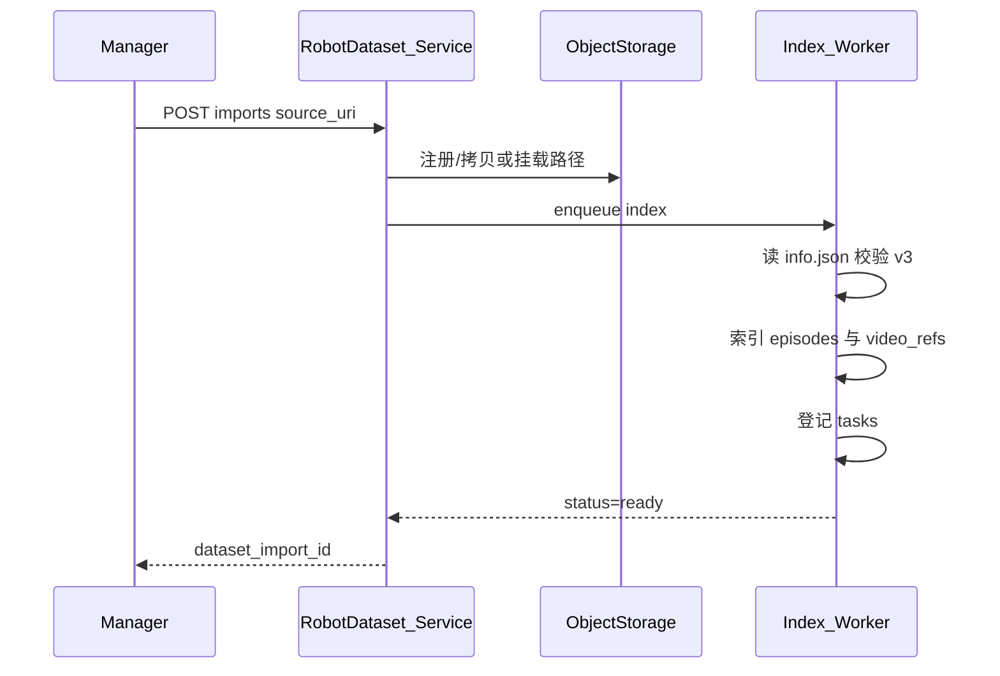

# 06 — 机器人数据（LeRobot v3）

## 1. 目标

让平台**原生**理解 LeRobot v3 布局，而不是先转成「扁平图片集」再丢失 episode / 多相机 / task 结构。

样例：`lerobot/datasets/svla_so100_pickplace`  
格式依据：`meta/info.json` + `meta/episodes/**/*.parquet` + `data/**/*.parquet` + `videos/{video_key}/.../*.mp4`。

## 2. 磁盘布局（只读约定）

```text
{dataset_root}/
  meta/
    info.json
    tasks.parquet
    stats.json
    episodes/chunk-XXX/file-YYY.parquet
  data/chunk-XXX/file-YYY.parquet
  videos/
    observation.images.top/chunk-XXX/file-YYY.mp4
    observation.images.wrist/...
```

`info.json` 关键字段：`codebase_version`、`robot_type`、`fps`、`total_episodes`、`total_frames`、`features`、`data_path`、`video_path`。

## 3. 导入流程



**校验**：

- `codebase_version` 以 `v3` 开头  
- 每个 video feature 在磁盘上可解析出至少一条 mp4  
- `total_episodes` 与 episodes 表行数一致性告警（不硬失败时可配置）  

**存储策略**：

- 开发：直接索引本地路径（如仓库内 `lerobot/datasets/...`）  
- 生产：导入时拷贝或托管到 `s3://{tenant}/datasets/{id}/`，原路径仅作 source 记录  

## 4. 媒体与预览轨

| 轨 | 用途 | 编码 |
| --- | --- | --- |
| original | 训练/归档下载 | 保持原样（常为 AV1） |
| preview | Studio 播放与抽帧 | H.264 + yuv420p，浏览器友好 |
| thumb | 时间轴 | 低分辨率 JPEG/WebP 序列或 sprite |

转码由 `Transcode_Worker` 异步完成；Job 可在 preview ready 前仅显示关键帧 JPEG（从原片服务端解码一帧）。

**说明**：用户本地播放器提示「需要 AV1 解码器」不影响平台——Studio 一律走 preview。

## 5. Episode 作为作业原子

- 列表字段：`episode_index`、`length`、`duration_s`、`task_text`、QA 标记、是否已有 Job。  
- 分派：`POST /projects/{id}/jobs/split` 按 episode 范围、过滤器（如 length、task、QA failed 排除）。  
- Studio 打开 Job：加载该 episode 各相机 preview + 帧窗口标注。  

多相机：**同一 `frame_index` 对齐**（依赖录制时钟；QA 报告跨相机时间差供人工知晓）。

## 6. 轨迹只读层

从 `data/*.parquet` 按 `episode_index` 读取：

- `action`、`observation.state`（如 6 维关节）  
- `timestamp`、`frame_index`、`task_index`  

Studio 底栏可视化；**V1 不提供动作重标编辑**（避免变成遥操作编辑器）。若未来要标「关键帧成功/失败」，用 Ontology 里的分类标签挂在帧上即可。

## 7. Data QA 服务

复用本仓库能力与思路：

- 脚本入口参考：`lerobot/script/2.lerobotv3数据质量分析.py`  
- 分析包：`lerobot/script/analyze/`  
- 报告落盘形态参考：`lerobot/run/<timestamp>/`  

平台化：

1. `POST /projects/{id}/qa` → Worker 跑对齐 +（可选）图像质量采样  
2. 结果写入对象存储 + `qa_reports` 表（summary JSON + 明细 URI）  
3. Portal 展示：length/span/fps 通过率、模糊/过曝/卡帧告警 episode 列表  
4. 项目设置：`block_assign_if_qa_fail`  

组成速览脚本（运维/调试）：`lerobot/script/4.lerobotv3数据集组成分析.py`。

## 8. 标注与 LeRobot 的关系

视觉标注**默认不改写**原始 `data/*.parquet`。

推荐旁路结构：

```text
{export_root}/
  manifest.json          # project、ontology_version、episode 范围
  annotations/
    episode_00000.json   # 每相机每帧几何
  coco/                  # 可选
  yolo/                  # 可选
  preview_map.json       # frame → media uri
```

`episode_XXXXX.json` 示意：

```json
{
  "episode_index": 0,
  "task": "Pick up the cube and place it in the box.",
  "fps": 30,
  "items": [
    {
      "frame_index": 10,
      "camera_key": "observation.images.top",
      "track_id": "t1",
      "label": "cube",
      "bbox": [100, 120, 50, 40],
      "source": "sam3"
    }
  ]
}
```

训练侧可用独立 dataloader 读旁路；Enterprise 可再提供「合并进自定义 feature」的回流插件。

## 9. 导出格式

| 格式 | 用途 |
| --- | --- |
| `lerobot_sidecar` | 上节旁路，保 episode 语义 |
| `coco` | 通用检测/分割生态；按相机拆子集或合并并加 `camera` 字段 |
| `yolo` | 检测训练；注意多相机分目录 |

导出过滤：仅 `accepted` Job；仅 `human`+已接受 Prediction 晋升的 Annotation。

## 10. 与通用图片项目的边界

V1 **可以**后续加 `format=image_folder`，但不得削弱 LeRobot 路径。  
机器人项目强制走 `RobotDataset_Service`；禁止 Manager 把 episode 拆成无关联散图导致无法回流。  
