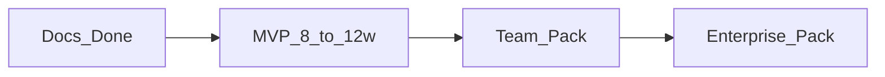

# 07 — 路线图与商业化里程碑

## 1. 原则

- 先打通 **一个样例集闭环**（`svla_so100_pickplace`）：导入 → QA → 预标 → 修订 → 审核 → 导出。  
- 文档阶段（本目录）完成后，再开代码仓/分包实现。  
- 范围以本文为准；新增模态或 3D 需单独立项。  

## 2. 阶段总览

## 3. MVP（约 8–12 周，2–3 人）

### 3.1 必须有

| 模块 | 交付 |
| --- | --- |
| 账号 | 单租户、JWT、四角色（可先 seed 用户） |
| 导入 | LeRobot v3 本地/S3 索引，episode 列表 |
| QA | 触发质检，挂载 summary（可先包装现有 `lerobot/script` CLI） |
| 转码 | 预览 H.264 或至少服务端抽帧 JPEG |
| Studio | 双相机切换、时间轴、矩形/多边形、SAM2 点选 |
| SAM3 | 当前帧文本预标 |
| Job | 按 episode 拆分、分派、提交 |
| Review | 通过 / 驳回 + 简单 Issue |
| Export | COCO + `lerobot_sidecar` JSON |
| 部署 | Docker Compose：api、worker、db、redis、minio、sam2、sam3 |

### 3.2 明确不做（MVP）

- 多租户计费、OIDC  
- 3D / 点云  
- VLM 自动写 task  
- 桌面客户端  
- 跨相机自动实例关联  
- 动作轨迹编辑  
- 完整一致率统计大盘  

### 3.3 MVP 验收用例

1. 导入 `lerobot/datasets/svla_so100_pickplace` 显示 50 episodes。  
2. 跑 QA 得到可打开的报告页。  
3. 对 episode 0 的 `cube` 用 SAM3 出掩码，SAM2 传播 30 帧，人工修正后 Accept。  
4. Reviewer Accept Job，导出 zip 含 sidecar + 可被 pycocotools 读取的 COCO（允许单相机子集）。  

## 4. Team 包（MVP 后 +1～2 季度）

- 多项目管理、批次、进度看板  
- 批量预标队列与公平限流  
- 审核抽检比例、基础一致率 / 预标采纳率报表  
- WebSocket 预标进度  
- 成员邀请与角色管理 UI  
- YOLO Adapter；预览转码稳定与失败重试  
- 备份与审计日志  

## 5. Enterprise 包

- 多租户与配额、OIDC/SSO  
- 私有模型仓与版本钉扎、GPU 池隔离  
- SLA、监控告警、高可用 Postgres  
- 定制 Ontology 与训练回流插件（写回客户训练流水线）  
- 现场私有化与安全扫描材料  

## 6. 商业化能力包对照

| 能力 | Community | Team | Enterprise |
| --- | --- | --- | --- |
| Compose 单机 | ✓ | ✓ | ✓ |
| LeRobot 导入导出 | ✓ | ✓ | ✓ |
| SAM2/3 交互 | ✓ | ✓ | ✓ |
| 角色分发审核 | 基础 | ✓ | ✓ |
| 批量预标队列 | 有限 | ✓ | ✓ |
| QA 报表 | 基础 | ✓ | ✓ |
| 多租户 / OIDC | | | ✓ |
| 私有模型仓 / SLA | | | ✓ |
| 定制回流 | | 插件试点 | ✓ |

## 7. 建议工程分解（代码阶段）

| 包 / 目录（建议） | 职责 |
| --- | --- |
| `apps/web` | Portal + Studio |
| `services/api` | FastAPI 领域服务 |
| `services/worker` | Celery/RQ：QA、转码、预标、导出 |
| `services/sam2` | SAM2 HTTP |
| `services/sam3` | SAM3 HTTP |
| `packages/lerobot_index` | v3 索引与 sidecar schema |
| `deploy/compose` | 一键启动 |

代码已落在本目录 monorepo：`packages/`、`services/`、`apps/web/`、`deploy/compose/`（见根 README 快速开始）。下一步按 MVP 清单补预览转码与真 SAM 权重接入。

## 8. 风险与缓解

| 风险 | 缓解 |
| --- | --- |
| AV1 播放兼容 | 强制 preview H.264；文档说明原片 |
| SAM 显存爆 | 会话窗口化、降分辨率、队列限流 |
| 多相机不同步 | QA 暴露 mismatch；Studio 显示警告 |
| 范围膨胀成通用标注平台 | 用本文非目标约束评审 |
| 开源许可（XAL GPL 等） | Web 自研画布；只参考交互，不 copy GPL 源码进商业闭源 |

## 9. 文档维护

- 架构或 API 变更时同步改 `02`、`03`、`openapi/sketch.yaml`。  
- MVP 开工前开 kickoff：冻结 Ontology 示例与 sidecar schema 版本号 `v1`。  
